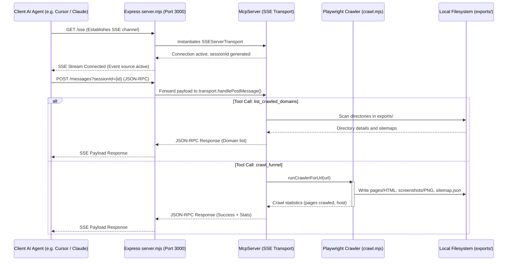

# Design Document: Native MCP Server for Funnel Aspirator

Funnel Aspirator is a powerful crawler designed to capture fully-rendered HTML pages, assets, and screenshots of marketing funnels. This document outlines the architecture for integrating a native Model Context Protocol (MCP) server directly inside the Express application, enabling external AI systems to interact with the scraper seamlessly.

## 1. Requirements

- **Expose Crawler as a Native MCP Tool**: Allow external AI agents (like Claude Desktop, Cursor, or peer agents) to initiate a crawl for any URL.
- **Provide Directory Discovery**: Enable agents to list all crawled domains and their page counts.
- **Provide Detail Extraction**: Let agents query detailed step-by-step pages, screenshots, and HTML references for a specific domain.
- **Seamless Integration with Coolify**: Expose endpoints over secure SSE (Server-Sent Events) at `https://aspirator.coolify.dallico.com/sse` and `https://aspirator.coolify.dallico.com/messages`.

## 2. Flow Design

The following diagram illustrates how the Client Agent, Express App, MCP Server layer, and Playwright Crawler interact:

## 3. Utilities

No external API wrapper is needed. We leverage the existing local `runCrawlerForUrl` utility:

- `name`: `runCrawlerForUrl` (`src/crawl.mjs`)
- `input`: `url` (string)
- `output`: `{ host, pages, dir }` (object)
- `necessity`: Drives the main web scraping and page acquisition process via Playwright.

## 4. Node Design

In the context of the Model Context Protocol, the "Nodes" are represented by the native tool handlers registered on the `McpServer` instance:

### A. Tool Node: `crawl_funnel`
- **Description**: Starts a web audit of a specific landing page or marketing funnel.
- **Input validation**: `url` (Zod string, URL format)
- **Execution**: Invokes `runCrawlerForUrl(url)`.
- **Post-processing**: Returns the statistics of crawled pages (or an error message if the crawl fails).

### B. Tool Node: `list_crawled_domains`
- **Description**: Returns all domains crawled by the server.
- **Input validation**: Empty object `{}`
- **Execution**: Reads the `exports/` folder, parses `sitemap.json` for each domain.
- **Post-processing**: Lists all domains, the number of crawled pages, and the first page screenshot as a thumbnail.

### C. Tool Node: `get_crawl_details`
- **Description**: Returns full sitemap details for a domain.
- **Input validation**: `domain` (Zod string)
- **Execution**: Reads `exports/{domain}/sitemap.json`.
- **Post-processing**: Returns the complete list of crawled pages, including HTML relative paths and screenshot relative paths.

## 5. Verification & Testing

1. **Local verification**: Start the Express server (`npm run dev`) and query the `/sse` stream to ensure that it issues a valid session ID and keeps the HTTP connection open.
2. **Post validation**: Direct a test JSON-RPC payload to `POST /messages?sessionId=...` and verify that the tools are returned correctly.
3. **Coolify deployment**: Push code changes to GitHub, trigger redeployment on Coolify, and test from an external agent using `https://aspirator.coolify.dallico.com/sse`.
